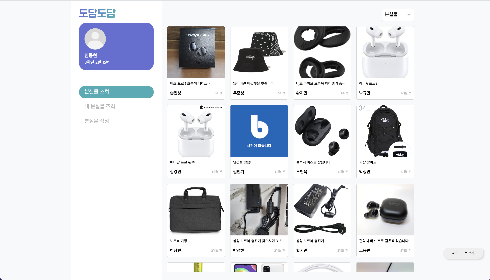
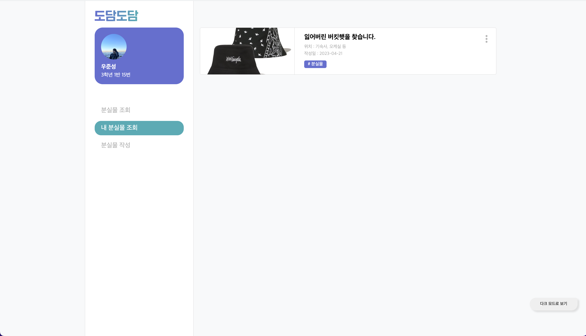
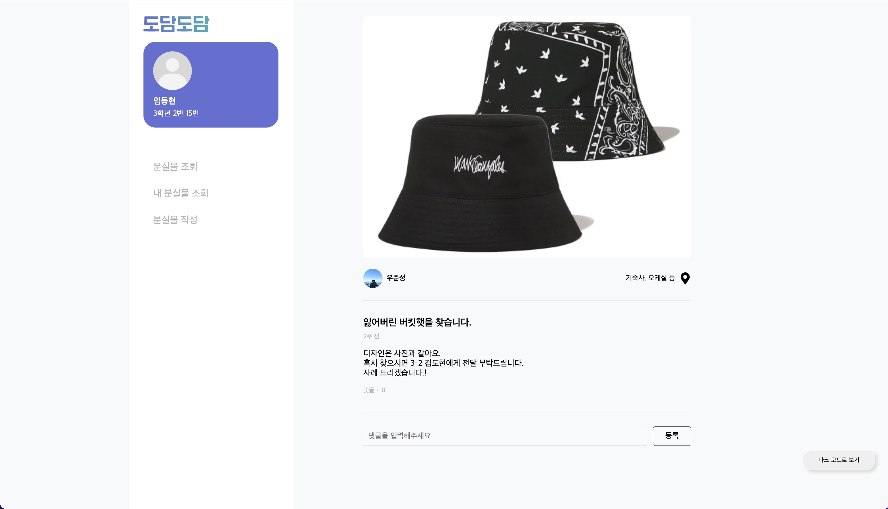
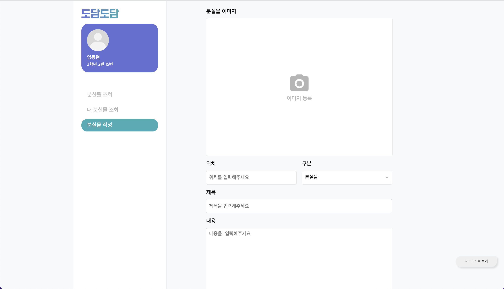

  

<h4 align="center">학생들을 위한, 학생들이 만든, 스마트스쿨 플랫폼</h4>

# [도담도담](https://dodam.b1nd.com/) 이란?

도담도담은 모든 학생과 모든 선생님에게 사고없이 편리함을 제공해줄 수 있는 스마트스쿨 플랫폼으로, 교내 전교생과 모든 선생님들이 사용하고 있어요.

> 아쉽지만 해당 서비스는 대소고학생 들만 사용할 수 있어요 🥲

# 도담도담 분실물페이지에서 하는일은?

- 도담도담 분실물페이지에서는 학교에서 잃어버리거나, 주운 물건에 대한 글을 작성해서 분실물을 다시 되찾을 수 있어요!
- 잃어버린 물건은 분실물, 주운 물건은 습득물로 분류되어 보여주고 있어요!

## 기능 리스트

- 분실물/습득물 관리 기능
  - 사진과, 위치, 구분(분실물/습득물), 제목, 내용을 입력하여 분실물/습득물을 등록할 수 있습니다.
  - 내가 등록한 분실물/습득물을 조회할 수 있습니다.
  - 현재 올라와있는 분실물/습득물을 조회할 수 있고, 댓글을 달 수 있습니다.

# 일정 페이지 화면

> 위 사진은 분실물 페이지의 메인페이지에요. 다른 사람들이 올린 분실물과 습득물을 볼 수 있어요.

> 위 사진은 분실물 페이지의 내 분실물 페이지에요. 자신이 올린 분실물/습득물 등을 따로 볼 수 있어요.

> 위 사진은 분실물 페이지의 상세 페이지에요. 분실물과 습득물의 상세한 정보를 알 수 있고 댓글을 달 수 있어요.

> 위 사진은 분실물 페이지의 작성 페이지에요. 여기서 모든 분실물/습득물 페이지가 작성돼요.

# 기술 스택

`TypeScript`, `React`, `Recoil`, `React-Query`, `Styled-Components`, `Axios`
